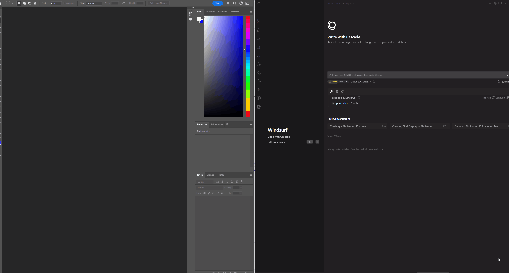

# Photoshop MCP 服务器

[](https://pypi.org/project/photoshop-mcp-server/)
[](https://pypi.org/project/photoshop-mcp-server/)
[](https://github.com/loonghao/photoshop-python-api-mcp-server/actions/workflows/python-publish.yml)
[](https://github.com/loonghao/photoshop-python-api-mcp-server/blob/main/LICENSE)
[](https://pypi.org/project/photoshop-mcp-server/)
[](https://github.com/loonghao/photoshop-python-api-mcp-server)
[](https://github.com/loonghao/photoshop-python-api-mcp-server/stargazers)
[](https://github.com/loonghao/photoshop-python-api-mcp-server/issues)
[](https://github.com/loonghao/photoshop-python-api-mcp-server/commits/main)

> **⚠️ 仅支持 Windows**: 此服务器仅适用于 Windows 操作系统，因为它依赖于 Windows 特有的 COM 接口。

一个使用 photoshop-python-api 的 Photoshop 集成的模型上下文协议 (MCP) 服务器。

[English](README.md) | 简体中文

## 概述

本项目提供了模型上下文协议 (MCP) 和 Adobe Photoshop 之间的桥梁，允许 AI 助手和其他 MCP 客户端以编程方式控制 Photoshop。



### 它能做什么？

通过这个 MCP 服务器，AI 助手可以：

- 创建、打开和保存 Photoshop 文档
- 创建和操作图层（文本、纯色等）
- 获取有关 Photoshop 会话和文档的信息
- 对图像应用效果和调整
- 以及更多功能！

## 要求

### 系统要求

- **🔴 仅支持 Windows 系统**：此服务器**仅**适用于 Windows 操作系统
  - 服务器依赖于 Windows 特有的 COM 接口与 Photoshop 通信
  - macOS 和 Linux **不受支持**，**无法**运行此软件

### 软件要求

- **Adobe Photoshop**：必须在本地安装（已测试 CC2017 至 2024 版本）
- **Python**：版本 3.10 或更高

## 安装

> **注意**：请记住，此软件包仅适用于 Windows 系统。

```bash
# 使用 pip 安装
pip install photoshop-mcp-server

# 或使用 uv
uv install photoshop-mcp-server
```

## MCP 主机配置

此服务器设计为与各种 MCP 主机一起工作。`PS_VERSION` 环境变量用于指定要连接的 Photoshop 版本（例如，"2024"、"2023"、"2022" 等）。

推荐使用 `uvx` 作为命令来配置服务器，这是官方标准格式。

### 标准配置（推荐）

将以下内容添加到您的 MCP 主机配置中（适用于 Claude Desktop、Windsurf、Cline 和其他 MCP 主机）：

```json
{
  "mcpServers": {
    "photoshop": {
      "command": "uvx",
      "args": ["--python", "3.10", "photoshop-mcp-server"],
      "env": {
        "PS_VERSION": "2024"
      }
    }
  }
}
```

### 配置选项

- **PS_VERSION**：指定要连接的 Photoshop 版本（例如，"2024"、"2023"、"2022" 等）
- **command**：使用 `uvx` 作为标准方法
- **args**：使用 `["photoshop-mcp-server"]` 运行 Photoshop MCP 服务器
  - 要显式指定 Python 版本，请使用 `["--python", "3.10", "photoshop-mcp-server"]`（支持从 3.10 到 3.14 的任何版本）

## 主要功能

### 可用资源

- `photoshop://info` - 获取 Photoshop 应用程序信息
- `photoshop://document/info` - 获取活动文档信息
- `photoshop://document/layers` - 获取活动文档中的图层

### 可用工具

服务器提供了各种控制 Photoshop 的工具：

- **文档工具**：创建、打开和保存文档
- **图层工具**：创建文本图层、纯色图层等
- **会话工具**：获取有关 Photoshop 会话、活动文档、选择的信息

## AI 助手提示词示例

一旦在 MCP 主机中配置好，您就可以在 AI 助手对话中使用 Photoshop MCP 服务器。以下是一些帮助您入门的示例提示词：

### 基础示例

```text
用户：能否创建一个新的 Photoshop 文档并添加一个带有"Hello World"的文本图层？

AI 助手：我将为您创建一个新文档并添加文本图层。

[AI 使用 Photoshop MCP 服务器：
1. 使用 `create_document` 工具创建新文档
2. 使用 `create_text_layer` 工具添加文本为"Hello World"的文本图层]

我已创建了一个新的 Photoshop 文档并添加了一个带有"Hello World"的文本图层。
```

### 更高级的示例

```text
用户：打开我最新的 PSD 文件并告诉我它有多少个图层。

AI 助手：我将检查您最新的 PSD 文件并计算图层数量。

[AI 使用 Photoshop MCP 服务器：
1. 获取有关打开文档的信息
2. 如果没有打开文档，它可以浏览并打开 PSD 文件
3. 检索并分析图层结构]

您的文档有 12 个图层，包括 3 个组文件夹和 2 个调整图层。
```

```text
用户：创建一个社交媒体帖子，带有渐变背景和粗体字"夏季促销"文本。

AI 助手：我将为您创建该社交媒体帖子。

[AI 使用 Photoshop MCP 服务器：
1. 创建一个适合社交媒体的新文档
2. 创建一个带有夏季颜色的渐变填充图层
3. 添加一个带有"夏季促销"文本的粗体字图层
4. 适当地定位和样式化文本]

我已为您创建了带有渐变背景和粗体"夏季促销"文本的社交媒体帖子。
```

## 许可证

MIT

## 致谢

- [photoshop-python-api](https://github.com/loonghao/photoshop-python-api) - Photoshop 的 Python API
- [Model Context Protocol](https://github.com/modelcontextprotocol/python-sdk) - MCP Python SDK
